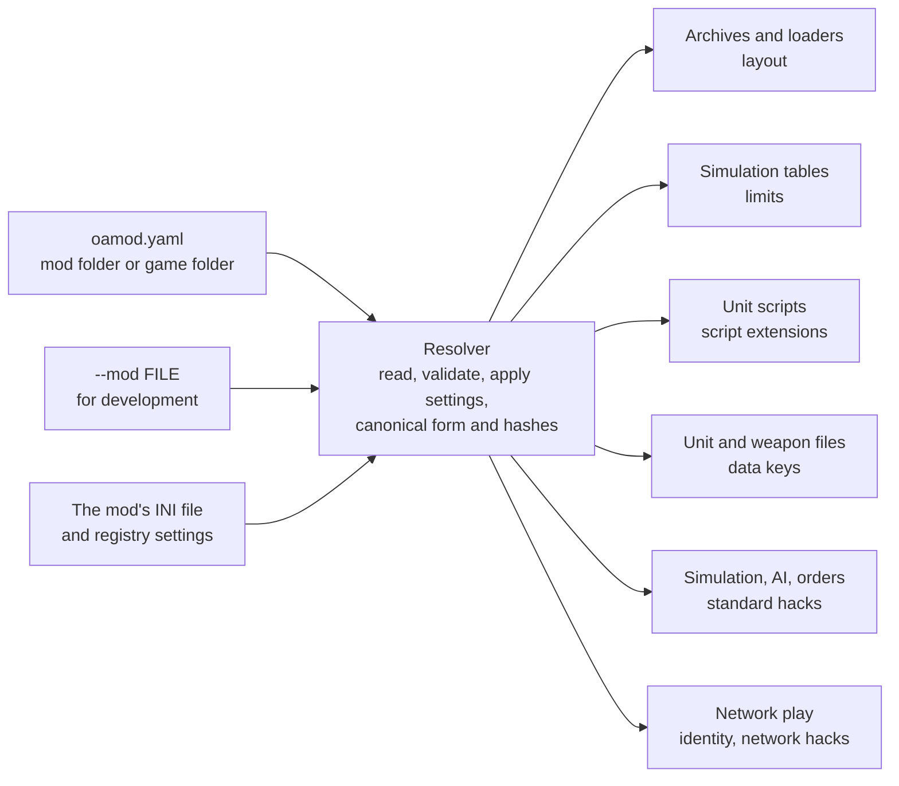

# The OAMOD standard

A mod profile, `oamod.yaml`, describes how one version of a mod differs from
Total Annihilation 3.1c. It is a YAML file written for people to read and
edit. It names the mod's archives and directories, its engine limits, the
unit-script values its scripts read, the extra keys in its data files, and
the **standard hacks** it turns on, each with its parameters. Open
Annihilation reads the file and plays the mod by those rules, with no code
of its own for any particular mod.

This document is the format and its rules as the engine implements them.
The standard hacks themselves are listed in the
[mod support overview](README.md), and each has a page of its own under
[standard-hacks/](standard-hacks/).

## Contents

- [1. Goals and principles](#1-goals-and-principles)
- [2. Concepts](#2-concepts)
- [3. The file](#3-the-file)
  - [3.1 Top-level keys](#31-top-level-keys) ·
    [3.2 A minimal profile](#32-a-minimal-profile) ·
    [3.3 Strict YAML rules](#33-strict-yaml-rules) ·
    [3.4 One file per mod](#34-one-file-per-mod) ·
    [3.5 Versioning](#35-versioning) ·
    [3.6 Validation and diagnostics](#36-validation-and-diagnostics)
- [4. Where the file lives](#4-where-the-file-lives)
  - [4.1 Copied install and mod folder](#41-copied-install-and-mod-folder) ·
    [4.2 Choosing a mod](#42-choosing-a-mod) ·
    [4.3 Command-line options](#43-command-line-options) ·
    [4.4 Saves and settings](#44-saves-and-settings) ·
    [4.5 The badge](#45-the-badge) ·
    [4.6 The .oamod package](#46-the-oamod-package)
- [5. Parameters, defaults and presets](#5-parameters-defaults-and-presets)
  - [5.1 What the registry declares](#51-what-the-registry-declares) ·
    [5.2 Ways to write a limit or hack](#52-ways-to-write-a-limit-or-hack) ·
    [5.3 Resolution order](#53-resolution-order) ·
    [5.4 Settings bindings and registry seeds](#54-settings-bindings-and-registry-seeds) ·
    [5.5 The host's choices](#55-the-hosts-choices) ·
    [5.6 How defaults are chosen](#56-how-defaults-are-chosen)
- [6. Identity, layout and limits](#6-identity-layout-and-limits)
  - [6.1 identity](#61-identity) · [6.2 layout](#62-layout) ·
    [6.3 limits](#63-limits)
- [7. Script extensions](#7-script-extensions)
  - [7.1 Mounting](#71-mounting) ·
    [7.2 Well-known extensions](#72-well-known-extensions) ·
    [7.3 Fidelity](#73-fidelity)
- [8. Data keys and engine conformance](#8-data-keys-and-engine-conformance)
  - [8.1 data-keys](#81-data-keys) ·
    [8.2 Behaviour mods rely on without a profile entry](#82-behaviour-mods-rely-on-without-a-profile-entry)
- [9. Standard hacks](#9-standard-hacks)
- [10. Strings and media](#10-strings-and-media)
- [11. The resolved profile and its hashes](#11-the-resolved-profile-and-its-hashes)
- [12. Network compatibility](#12-network-compatibility)
  - [12.1 Where a rule runs](#121-where-a-rule-runs) ·
    [12.2 What every machine must share](#122-what-every-machine-must-share) ·
    [12.3 Wire behaviour a profile selects](#123-wire-behaviour-a-profile-selects)
- [13. Engine integration](#13-engine-integration)
- [14. A fuller example](#14-a-fuller-example)
- [15. Glossary](#15-glossary)

## 1. Goals and principles

A profile lets the engine play a mod as the mod plays, in single player and
in network games, while the engine itself stays free of code for any
particular mod.

| Goal | What it means in practice |
| --- | --- |
| Gameplay compatibility | Under a mod's profile the engine computes what the mod's rules compute: the same limits, rules, script results and edge cases. |
| Network compatibility | Machines playing the same profile agree on every rule that decides the game, and a profile names the wire behaviour its games use. |
| Absent means 3.1c | A folder without a profile plays exactly as 3.1c. Every hack, limit and key has a 3.1c baseline. |
| Shared behaviour, shared hack | A behaviour two mods share is one standard hack with parameters. A mod chooses hacks and values, never code. |
| One readable format | Profiles are YAML with comments. A strict subset and one canonical form mean every reader understands and hashes a profile the same way. |

The principles that follow from these goals:

1. **Behaviour, never code.** A profile names a behaviour and its
   parameters, and never carries code. The engine implements each
   behaviour once, in the module that owns it.
2. **Absent means 3.1c.** A hack that is absent, or written `false`, plays
   as 3.1c. Every hack that can express 3.1c while on has a `baseline`
   preset, and a profile that turns on every such hack at its `baseline`
   preset plays exactly as no profile.
3. **One hack per behaviour, parameters for variants.** A second hack id
   exists only when no parameter can cover both variants.
4. **Exact results.** Where a rule truncates, wraps around or ignores a
   command, the hack does the same, and its page says so.
5. **Ownership is declared.** Each entry says which machines run it in a
   network game: the unit's owner, every machine, the host, or only the
   local view ([12.1](#121-where-a-rule-runs)).
6. **Settings stay the player's.** A value the game reads from its INI file
   or its registry settings stays bound to that key, with the profile's
   value as the default ([5.4](#54-settings-bindings-and-registry-seeds)).

## 2. Concepts

Every difference between a mod and 3.1c falls into one of a few kinds, and
each kind has one reader in the engine. The resolver turns the mod's
`oamod.yaml` and the player's settings into one resolved profile. Each part
of the engine reads only its own block, and the profile's sim hash names the
ruleset wherever a game is saved or played over the network.



| Kind | What it captures | Read by | Example |
| --- | --- | --- | --- |
| Identity | Who the mod is on the wire and on disk | Network play, settings, menus | `network-version: [20, 1]` |
| Layout | Where data comes from | Archive discovery and data loaders | `directories: {units: unitsX}` |
| Limits | Sizes and bounds | Simulation and loaders | `units-per-player: {default: 1000, max: 1000}` |
| Script extensions | Values unit scripts can `get` beyond 3.1c's | The unit-script machine | `get: {71: unit.my-id}` |
| Data keys | Extra keys in unit and weapon files | Data loaders | `VeterancyThresholds: veterancy.thresholds` |
| Standard hacks | Behaviour switches with parameters | The module that owns each rule | `units.id-reuse-delay: true` |
| Settings | Bindings to the mod's INI and registry settings, and registry seeds | The resolver | `limits.effects.queue: {ini: Preferences/SfxLimit}` |
| Strings | Replacement engine texts | The interface ([10](#10-strings-and-media)) | `status: {nanolathing: Building}` |
| Media | Front-end movie names | The front end ([10](#10-strings-and-media)) | `movies: {intro: ""}` |

The **hack registry**,
[`src/data/mod-profile/registry/hack-registry.yaml`](../../src/data/mod-profile/registry/hack-registry.yaml),
is the single source of truth for every name a profile may use: each entry,
its parameters, their types and bounds, their 3.1c baselines and their
defaults. The engine's tables and records are generated from it.

## 3. The file

`oamod.yaml` is one YAML document. It never contains code: every
difference is an identity value, a layout entry, a limit, a
script-extension mount, a data-key binding, a standard hack with
parameters, a settings binding, or replacement text and media.

### 3.1 Top-level keys

Only these keys may appear at the top level. `oamod`, `id`, `name`,
`version`, `author` and `packaging` are required; every other key is
optional.

| Key | Holds | Example |
| --- | --- | --- |
| `oamod` | The format version, the integer `1` | `oamod: 1` |
| `id` | The mod's stable id: lower-case words of `a`-`z` and `0`-`9` joined by single hyphens | `id: example-mod` |
| `name` | The mod's display name, a string | `name: Example Mod` |
| `version` | The mod's version, a string | `version: "2.1"` |
| `description` | One line about the mod, a string of at most 120 characters with no line break or other control character. The Mods page of the Open Annihilation settings shows it under the mod's name and version. | `description: "Larger armies and renamed data directories."` |
| `requires` | The base game and registry catalogue the profile is written for: `base` must be `ta-3.1c` and `catalogue` must be `1` | `requires: {base: ta-3.1c, catalogue: 1}` |
| `author` | Who made the mod: `name`, and optionally `email` | `author: {name: A. Modder}` |
| `packaging` | Who packaged the profile and the mod's files, when, and how often since: `revision`, `date` and `packager` | `packaging: {revision: 1, date: 2026-10-04, packager: P. Packer}` |
| `identity` | Display version, network version bytes, settings file, registry root, side names | `network-version: [20, 1]` |
| `layout` | Revision archive, installation archives, archive patterns, directory names, unit file extension, map units section, disc check | `directories: {units: unitsX}` |
| `limits` | Engine limits | `effects: {queue: 8192}` |
| `script-extensions` | Fidelity, and well-known extensions mounted at `get` and `set` indices | `get: {71: unit.my-id}` |
| `data-keys` | Keys in unit and weapon files, bound to registry meanings | `weapon: {nottoair: weapons.not-to-air}` |
| `hacks` | Standard hacks: `true`, a shorthand value, a mapping of a preset and parameters, or `false` | `repair.rate: true` |
| `settings` | Bindings of parameters to the mod's INI or registry settings, and `registry-seeds` | `limits.effects.queue: {ini: Preferences/SfxLimit}` |
| `strings` | Replacement engine texts by name | `status: {nanolathing: Building}` |
| `media` | Front-end movie names | `movies: {intro: ""}` |

`identity`, `layout`, `limits`, `hacks`, `data-keys`, `strings`, `media` and
`settings` must each be a mapping when present.

`author` and `packaging` are mappings of these keys, and hold nothing else:

| Key | Holds | Required |
| --- | --- | --- |
| `author.name` | The mod's author or team, a string of 1 to 128 bytes; `unknown` when nobody is known | yes |
| `author.email` | The author's e-mail address, a string of at most 254 bytes with one `@` and a dot in the part after it | no |
| `packaging.revision` | The package's revision, an integer from 1 to 65,535: 1 for the first package, raised by one for each update of the same mod version | yes |
| `packaging.date` | The day the package was made, an ISO 8601 calendar date `YYYY-MM-DD` that exists | yes |
| `packaging.packager` | Who made the package, a string of 1 to 128 bytes | yes |

They describe the package, not the rules: they enter the full hash, never
the sim hash ([11](#11-the-resolved-profile-and-its-hashes)). A date written
plainly, `date: 2026-10-04`, is a string, as [3.3](#33-strict-yaml-rules)
says.

### 3.2 A minimal profile

```yaml
# A mod that raises the unit limit and turns on two shared rules.
oamod: 1
id: small-mod
name: Small Mod
version: "1.0"
author: {name: A. Modder}
packaging: {revision: 1, date: 2026-10-04, packager: A. Modder}

limits:
  units-per-player: {default: 500, max: 1000}

hacks:
  units.id-reuse-delay: true
  economy.deterministic-wind: true
```

Everything the file leaves out plays as 3.1c. This profile raises the
per-player unit limit to a default of 500, offered up to 1,000, and turns on
[`units.id-reuse-delay`](standard-hacks/units.id-reuse-delay.md) and
[`economy.deterministic-wind`](standard-hacks/economy.deterministic-wind.md)
at their registry defaults. A fuller example is in
[section 14](#14-a-fuller-example).

### 3.3 Strict YAML rules

Profiles use a strict subset of YAML 1.2, which the engine reads with its
own reader ([src/formats/oamod](../../src/formats/oamod/README.md)), so that
any two readers agree on what a file means. A file that breaks a rule is
refused with the rule and the line and column where it is broken.

- **Encoding and size.** UTF-8 without a byte order mark; at most 256 KiB,
  65,536 nodes and 16 levels of nesting; no key or string longer than
  4,096 bytes. One document, whose top level is a mapping, with one
  optional `---` before it and `...` after it.
- **Grammar.** Block mappings (`key: value`) and block sequences
  (`- item`), nested by space indentation, and flow mappings (`{a: 1}`) and
  flow sequences (`[1, 2]`), freely mixed. Plain, single-quoted and
  double-quoted scalars, each on one line.
- **Refused by name.** Tags (`!`), anchors (`&`), aliases (`*`), merge keys
  (`<<`), directives (`%`), complex keys (`?`), block scalars (`|` and `>`),
  multi-line scalars, a second document, a duplicate key at any level, a
  tab in indentation, and control characters.
- **Types.** Mappings, sequences, strings, numbers, booleans and null.
  `true` and `false` (also `True`, `TRUE`, `False`, `FALSE`) are the only
  booleans: `yes`, `no`, `on` and `off` are strings. `null`, `~` and an
  empty value are null. A quoted scalar is always a string.
- **Numbers.** Decimal only: `-?(0|[1-9][0-9]*)` is an integer, and the
  same followed by a fraction or an exponent is a decimal. `0x10`, `1_000`,
  `+1`, `.5` and `2024-12-01` are strings. Integers stay within ±2^53;
  decimals have at most 15 significant digits. Numbers are kept exactly as
  written, so a reader that uses binary floating point reads the same value.
  The resolver converts each number to its parameter's type and refuses a
  value that does not fit.
- **Text that looks like a number.** A value that must stay text is quoted:
  `version: "2.1"`. Unquoted, `2.1` is a number and the profile is refused.
- **Keys.** Keys are strings or integers. A plain key that reads as an
  integer (`71: unit.my-id`) is an integer key; a quoted key is always a
  string, so `71` and `'71'` are different keys. A plain key that reads as
  a boolean, null or decimal is refused. The keys this standard defines are
  case-sensitive kebab-case; data-key names and registry value names keep
  the mod's spelling.
- **File names in values.** Archive, directory and file names (`unitsX`,
  `examplemod.gp3`) keep the mod's spelling and are matched without case,
  as the game matches them.
- **Quoting.** A string that starts with a YAML indicator (`*`, `%`, `&`,
  `!`, `@`) or holds `: ` or ` #` is quoted. Single quotes keep backslashes
  as written (`'Software\Example Mod'`).
- **Comments.** `#` comments start a line or follow white space, may appear
  anywhere, and are the place to explain a value. They are not part of the
  ruleset and never reach the hashes.

### 3.4 One file per mod

A profile is complete in itself. It never includes or extends another file,
so everything that decides how a mod plays is in one place. Rules several
mods share are shared through the registry, by the same hack ids,
parameters and defaults, not through files that include each other.

Writing `false` for a limit or hack means the same as leaving it out. It
records a deliberate choice.

### 3.5 Versioning

`oamod` changes only when the grammar changes; this document describes
grammar `1`. The registry carries its own catalogue number, `1`; a profile
that names a catalogue in `requires` must name this one. A hack whose
meaning changes gets a new id, and the old id keeps its meaning, so an
existing profile never changes how it plays.

### 3.6 Validation and diagnostics

The engine checks the whole profile against the registry before it plays.
It refuses the profile, naming the offending path and where it is written,
on:

- a YAML rule broken ([3.3](#33-strict-yaml-rules));
- an unknown top-level key, identity, layout, string or media key, limit,
  hack, parameter, preset, script extension or data-key meaning;
- a value of the wrong type, out of range, not a multiple of what it must
  be, too long, not matching its pattern, of the wrong length, repeated or
  not in ascending order where the parameter requires it;
- `requires` naming another base game or catalogue;
- a missing `author` or `packaging` block, a missing `author.name`,
  `packaging.revision`, `packaging.date` or `packaging.packager`, a
  malformed e-mail address, or a date that is not a calendar day;
- a `description` that is not a string, holds a line break, a line or
  paragraph separator or another control character, or is longer than 120
  characters (counted as Unicode characters, not bytes);
- a script index mounted twice, outside 0 to 65,535, or inside 3.1c's own
  range 1 to 20; an extension mounted at two indices; an extension of the
  other direction;
- a settings binding of a `fixed` parameter, or one not written as
  `{ini: Section/Key}` or `{registry: Name}`;
- a constraint between parameters broken, such as a unit limit default
  above its maximum;
- a data key bound to a meaning whose hack is off;
- a hack this engine does not implement yet;
- two `installation-archives` names that differ only in the case of their
  letters;
- a named installation archive that is missing from the installation, or
  that is there but cannot be opened.

Every diagnostic is one line, `file:line:column: path: message`:

```text
oamod.yaml:21:5: hacks.repair.rate: unknown parameter 'speed' (have [mode])
```

When the fault is found while mounting and is not a place in the file, the
line and column are left out, `file: path: message`:

```text
oamod.yaml: layout.installation-archives: installation archive 'addon.ccx' is missing
```

A profile with any error is never played, and the engine never falls back
to 3.1c in its place: the folder becomes unusable and every error is shown.
Warnings, such as a setting that does not read as its type, are shown and
the profile plays.

The registry marks each hack `implemented` or not. A profile that turns on a
hack the engine does not implement yet is refused, so partial support is
never silent. For development, `--accept-unimplemented-hacks` turns each
such refusal into a warning.

## 4. Where the file lives

`oamod.yaml` sits in the root of the mod's folder. Its name is matched
without case; a folder that holds two names differing only in case is
refused.

### 4.1 Copied install and mod folder

A mod can be installed in either of two ways, and both give the same game:

- **Copied install.** The mod's files are copied into the game folder
  itself, and `oamod.yaml` sits in the game folder's root.
- **Mod folder.** The mod's files, `oamod.yaml` among them, stay in a folder
  of their own, layered over an unmodified game folder. One game folder then
  serves every mod.

The engine reads the profile before it mounts any archive:

- **Present:** the profile is read, validated and applied. A profile that
  fails validation stops the game from starting and names every error.
- **Absent:** the folder plays 3.1c. A mod folder without a profile is
  still layered over the game folder, as below, and the game plays its
  files by 3.1c's own rules.

A mod folder over a game folder gives exactly the files a copied install of
the same files would give:

- A file in the mod folder replaces the game folder's file of the same path,
  compared without case, as copying would overwrite it.
- Archive discovery (the revision archive, then the `ccx` and `ufo` groups,
  then the installation archives the profile names, then the `hpi` group
  with its ten-archive limit, in the order of [6.2](#62-layout)) runs over
  the two folders merged, file by file.
- An empty file wins its path like any other, and so hides the file beneath
  it.
- The game folder under a mod folder must be plain 3.1c: a game folder that
  holds its own `oamod.yaml` cannot carry a mod folder.
- A folder named `.backup`, in any case, at the top of the mod folder or the
  game folder is never layered, searched or mounted from: a mod folder keeps
  the version an update replaced there ([4.6](#46-the-oamod-package)).

### 4.2 Choosing a mod

One profile plays per run. The profile comes from, in order:

1. the file `--mod` names;
2. else the mod folder's own `oamod.yaml`: the folder `--mod-dir` names, or
   the one the preferences remember;
3. else the game folder's own `oamod.yaml`, for a copied install.

The **Mods** page of the Open Annihilation settings lists the mod folders
in the game folder's `mods` folder and in the player's own
`Documents/Open Annihilation/Mods` folder, the mod being played first. Each
row shows the mod's badge ([4.5](#45-the-badge)), and from its `oamod.yaml`
its `name`, its `version` and its `description`; a folder without an
`oamod.yaml` shows the folder's name, "N/A" and "No oamod.yaml present".
Choosing another mod there, once the player confirms it, reloads the game's
data for that mod and returns to the main menu without restarting the game,
and the choice is remembered for later starts. A remembered mod folder that
is gone is dropped with a notice. There is no detection of installed mods
and no built-in list of mods. The [mod support overview](README.md#choosing-a-mod)
describes the page.

The page lists no folder whose name starts with a dot, as file managers
hide such folders: the folders an install of a `.oamod` package keeps in
`Mods` while it works are named so.

### 4.3 Command-line options

| Option | What it does |
| --- | --- |
| `--mod FILE` | Reads the profile from `FILE` instead of the folder's own, for development and for mods that do not ship a profile. |
| `--mod-dir PATH` | Plays the mod folder at `PATH`, layered over the game folder. |
| `--base-game` | Plays without the remembered mod folder. It cannot be combined with `--mod-dir`. |
| `--print-profile` | Prints the resolved profile of `--mod FILE`, or of the `--mod-dir` or `--game-dir` folder, and exits. The output is the effective profile as indented JSON, then a `sha256-sim` line and a `sha256-full` line with the two hashes. The folder's INI settings are applied, as a game applies them. A folder without a profile prints that it plays 3.1c; a profile with errors prints each, one a line, and exits with status 1. |
| `--accept-unimplemented-hacks` | Accepts, with a warning each, hacks this build does not implement yet. For development only; it needs a mod (`--mod`, `--mod-dir`, `--game-dir` or `--print-profile`). |
| `--trace-lookups FILE` | Writes every game file and listing the run looks up, one a line, which shows that a renamed directory is never read by its base name. |

Every run that plays a profile names it and its sim hash.

### 4.4 Saves and settings

Game folders are never written to.

- **Saved games** go to `Saves/default` in the player's own folder,
  `Documents/Open Annihilation/Saves/default` ("Where it keeps its files" in the
  [installation guides](../installation/macos.md#where-it-keeps-its-files)),
  and with a profile to `Saves/<id>`, so different mods never share a list
  of saved games. The saved games versions before 0.7 kept beside the
  preferences file are moved there once, on the first start. A save made
  under a profile records the profile's id, version, catalogue and hashes,
  and loads only under a profile with the same sim hash; otherwise the
  status line names both. A save without a profile record loads under any
  profile.
- **The mod's INI file** (`identity.settings-file`) is read, never written,
  from the first folder that holds it, the mod folder first.
- **Registry settings** are kept in the engine's own preferences, under the
  profile's registry root, unless that root is 3.1c's own. On a mod's first
  run, the profile's registry seeds are written there wherever no value of
  that name, matched without case, exists yet.

### 4.5 The badge

A mod folder can hold a badge: a PNG image named `oamod.png`, matched
without case, beside its `oamod.yaml`. The Mods page shows it, about 40
pixels across, at the left of the mod's row.

- Make it square, 64 by 64 pixels. A badge larger than that is scaled down
  to fit within 64 by 64 as it is read, keeping its proportions.
- Any standard PNG colour type and bit depth is read: grey, grey with
  alpha, RGB, RGB with alpha and palette images, interlaced or not. An
  alpha channel is kept; transparency given by a `tRNS` chunk is not, so a
  palette badge is drawn opaque.
- The badge is optional. When it is missing, cannot be read, is not a PNG,
  is larger than 256 by 256 pixels or is over 256 KiB, the row shows a blank
  dashed placeholder in its place, and the mod plays all the same.

The badge is not part of the profile: it never changes the profile's hashes
and is never checked when the mod is played.

### 4.6 The .oamod package

A mod is shipped as one file, a `.oamod` package: a zip archive of the
mod's folder, which the game installs into the player's own
`Documents/Open Annihilation/Mods` folder ([installing one](README.md#installing-a-oamod-file)).

**The format.** A zip archive on one disk, its entries stored (method 0) or
deflated (method 8). The 64-bit extension is read too, which some tools
write for any archive; it does not raise the limit below, of 4 GiB
unpacked in all. `oamod.yaml`, its name matched without case, lies at the
archive's top, or in the one folder the top holds, which is stripped: the
Finder's Compress makes such a package. `__MACOSX` folders, `.DS_Store`
files, AppleDouble files (a last part starting `._`) and a `.backup` folder
of the package's own are ignored. Names are UTF-8 when an entry says so, else code page 437, or the
UTF-8 a Unicode path extra field gives; the backslashes of an entry made on
MS-DOS or Windows are folder separators.

Every name must unpack alike on every system the game runs on: no absolute
path, drive letter or `..`; each part 1 to 255 bytes of UTF-8, without
control characters or `< > : " | ? * \`, not ending in a dot or a space,
and not a name Windows keeps for a device (`CON`, `PRN`, `AUX`, `NUL`,
`COM0` to `COM9`, `LPT0` to `LPT9` and the like, before any extension, in
any case); no two names that differ only in the case of their ASCII
letters, as the game matches names, and no file and folder of one name.
Links, special files and encrypted entries are refused. A package may
unpack to at most 4 GiB and 16,384 folders, and, past 64 MiB, to at most
200 times its own size. The profile must pass the validation of [3.6](#36-validation-and-diagnostics)
as a load of the mod would: resolved twice, the second time with the INI
file the package holds, or the game folder's, and the player's registry
settings. Its id must not name a device on Windows. Everything is checked
before anything is written.

**Where it installs.** Into `Mods/<id>`, by the profile's `id`, never by
the file's name:

- no folder of that name: it installs there, with no question;
- the same id and `version`, another `packaging.revision`: it replaces the
  folder once the player agrees, which is told when the package is the
  older revision;
- the same id, version and revision: it reinstalls, once the player agrees;
- the same id at another version: the player chooses to replace it, or to
  install it alongside in `Mods/<id>-<version>`, the version made safe for
  a folder's name (lower case letters, digits, `.`, `_` and `-`), then
  `-2` and so on while that name is taken; a later revision of that
  version updates the folder made alongside;
- a folder of that name that holds something else is never replaced: the
  package can be installed alongside.

**One version back.** A replace keeps the version it replaced in the mod's
folder, in `.backup`, and drops what `.backup` held: three installs of
revisions 1, 2 and 3 leave 3 in the folder and 2 in `.backup`. A reinstall
leaves `.backup` as it is. Rolling back swaps the folder's version and the
one in `.backup`, so it can be undone, one version deep. `.backup` is
invisible to the game: never layered over the game folder, never searched
for archives, never listed on the Mods page.

**How it is put in place.** The files are unpacked into a staging folder
inside `Mods`, a little at a time, each made anew and synced to storage,
its size and CRC-32 checked; the change is then made by renames on that
volume, each refusing a name that exists. A `.backup` or other folder an
install drops that is a link to a folder elsewhere loses only the link. A
stop at any point leaves folders that the next start settles to the state
before the change or after it; a change to the mod the game plays is made
between two runs, once its archives are closed. The folders an install
keeps in `Mods` while it works start with `.oamod-`; `Mods/.oamod-lock`
keeps a second copy of the game from changing the folder at the same time.

## 5. Parameters, defaults and presets

Every limit and standard hack declares typed parameters, and each parameter
carries two reference values: a **baseline** that plays as 3.1c, and a
**default** used whenever the entry is on without that parameter. A profile
writes only what it changes, a mod can tune a rule without code, and the
registry is the one place defaults live.

### 5.1 What the registry declares

For each parameter:

| Field | Meaning | Example: `units.id-reuse-delay`, parameter `ticks` |
| --- | --- | --- |
| `type` | `bool`, `int`, `decimal`, `string`, `enum`, `list<int>`, `list<decimal>`, `list<enum>`, `list<string>`, `set<enum>`, or `int-or-none` (an integer or the string `none`) | `int` |
| `values` | The members of an enum; a `set<enum>` resolves in this order | — |
| `min`, `max` | Inclusive bounds, element by element for lists | 0 to 30,000 |
| `multiple-of`, `length`, `order`, `distinct`, `pattern`, `max-length` | Further restrictions on a value | — |
| `unit` | What a number counts | ticks |
| `baseline` | The value that plays as 3.1c | `0` |
| `default` | The value when the entry is on and nothing sets the parameter | `150` |
| `default-from` | A default that follows another parameter: `{param, factor}` | — |
| `adjustable` | Who may change it: `fixed` (the profile only), `install` (the player's settings, once the profile binds them), `match` (as `install`, and the host may also change it for one game) | `fixed` |
| `scope` | `sim` (part of the sim hash; every machine must agree) or `view` (local display, input, sound or files; not in the sim hash) | `sim` |
| `setting` | The INI key (`Section/Key`) or registry value the game reads for it, for a settings binding | — |
| `clamp-between` | Two parameters a setting or host value is held between | — |
| `per-unit`, `per-weapon` | The data-key meaning that overrides the value for one unit or weapon type | — |

For each entry, the registry also gives:

- `ownership`: which machines run it in a network game ([12.1](#121-where-a-rule-runs));
- `scope`: whether the entry's presence enters the sim hash;
- `implemented`, for hacks: whether this engine carries the behaviour out;
- `shorthand`: the one parameter a bare value sets, for entries that have one;
- `constraints`: relations between parameters, checked after resolution,
  such as `min <= default` and `default <= max`;
- `presets`: named, complete parameter sets.

Presets are named for what they do, never for a mod. Every entry that can
express 3.1c while on has a `baseline` preset, which sets each parameter to
its 3.1c value.

### 5.2 Ways to write a limit or hack

```yaml
limits:
  unit-types: true                       # on, every parameter at its default
  path-search-budget: 20000              # shorthand: sets the one parameter, nodes

hacks:
  units.id-reuse-delay: true             # on, every parameter at its default (150 ticks)
  ai.attack-wave-size: 12                # shorthand: sets units
  sharing.structure-gift-rate-limit:     # on, one parameter changed, the rest at their defaults
    defer-ticks: 600
  veterancy.model:                       # a preset, then overrides
    preset: baseline                     #   3.1c's kill counting and bonuses...
    level-source: thresholds             #   ...but levels from per-unit kill thresholds
  weapons.high-arc-ballistic: false      # off: plays as 3.1c, the same as leaving it out
```

| Written as | Means |
| --- | --- |
| `true` | On, every parameter at its default. |
| A mapping | On. An optional `preset` sets its values; each parameter written then overrides it; the rest stay at their defaults. |
| A bare value | On, with the entry's shorthand parameter set to the value. Only entries that declare a shorthand accept it. |
| `false` | Off. The entry plays as 3.1c, the same as leaving it out. |

Every limit is always resolved: a limit the profile leaves out plays at its
3.1c baseline. A hack the profile leaves out is simply not on.

### 5.3 Resolution order

Each parameter resolves in this order; later steps win.

1. **Baseline**, when the entry is absent or `false`.
2. **Registry default**, when the entry is on. A `default-from` parameter
   follows its source parameter instead: `limits.effects.reserve` is ten
   times `queue` unless something sets it.
3. **The named preset**, if one is given.
4. **The profile's own value.**
5. **The player's settings**, for `install` and `match` parameters the
   profile binds under `settings`.
6. **The host's choice for this game**, for `match` parameters.
7. **A per-unit or per-weapon data key**, for that unit or weapon type only,
   applied when its files are read (for example `veterancy.thresholds`
   overriding `veterancy.model`'s `default-thresholds`).

After steps 5 and 6, a parameter with `clamp-between` is held between the
two parameters it names, with a warning when it moves. Constraints are
checked after the profile's own values and again at the end.

### 5.4 Settings bindings and registry seeds

A parameter that the game reads from its settings stays the player's. The
profile binds it under `settings`, by its path, `ENTRY.PARAM`, or by the
entry's id alone for an entry with a shorthand:

```yaml
settings:
  limits.units-per-player.default: {registry: UnitLimit}
  limits.effects.queue: {ini: Preferences/SfxLimit}
  limits.path-search-budget: {ini: Preferences/AISearchMapEntries}
  registry-seeds:
    GameSpeed: 10
```

- `{ini: Section/Key}` reads the key from the mod's INI file
  (`identity.settings-file`). `{registry: Name}` reads the value of that
  name from the settings kept under the profile's registry root. Names are
  matched without case.
- Only `install` and `match` parameters can be bound; binding a `fixed`
  parameter is an error. A binding whose limit or hack is not on in the
  profile is ignored with a warning.
- A binding written `false` binds nothing.
- The setting's text is read as the game reads it: white space at either
  end is dropped, and in an INI file a `;` ends the value. Numbers are
  decimal and may have leading zeros. A boolean reads `1`, `0`, `true`,
  `false`, `yes`, `no`, `on` or `off`, without case. An enum reads one of
  its values, without case. List parameters cannot be bound.
- A setting that does not read as its type is ignored with a warning. One
  outside the parameter's bounds is clamped into them, with a warning.
- `limits.unit-types.bitset-bits` takes its setting in steps of 512: a
  value up to 512 gives 512, and a larger value `v` gives
  `((v >> 9) + 1) * 512`.

`registry-seeds` maps registry value names to integers or strings. They
stand in for registry values the player has not set, both while the profile
resolves and on the mod's first run ([4.4](#44-saves-and-settings)), so a
fresh install starts where the mod's own install would.

### 5.5 The host's choices

A `match` parameter may also be changed by the host for one game, after the
player's settings. The resolver takes each choice as `ENTRY.PARAM=VALUE`,
the value written as in a profile. A choice for a parameter that is not
`match`, or for an entry the profile does not turn on, is refused. The
unit limit's `default` is held between its `min` and `max`.

The `match` parameters in the registry are the unit limit
(`limits.units-per-player.default`) and the game speed range
(`console.game-speed-range.min` and `max`).

### 5.6 How defaults are chosen

Turning an entry on with no parameters gives the variant most mods use. A
mod whose values differ writes them in its own profile, so the file itself
shows how that mod differs. The defaults are part of the catalogue: they do
not change within catalogue `1`.

## 6. Identity, layout and limits

Identity, layout and limits are plain values rather than hacks: every mod
has them, and the engine reads them before any game data loads. Two rules
hold for layout: a renamed directory replaces the base one everywhere and
never falls back to it, and an empty file still wins its path.

### 6.1 `identity`

Identity keys are written directly under `identity`.

| Key | Meaning | 3.1c | Type | Scope |
| --- | --- | --- | --- | --- |
| `display-version` | The version text on the main menu | `v3.1` | string, at most 16 | view |
| `network-version` | The two network version bytes, major then minor. Also the build version unit files are checked against: a unit whose `Version` is later is unavailable. | `[3, 1]` | two integers, 0 to 255 | sim |
| `replay-network-version` | The version bytes a replay presents | `[3, 1]` | two integers, 0 to 255 | sim |
| `settings-file` | The name of the INI file the game reads its settings from | `totala.ini` | string, at most 64 | view |
| `registry-root` | The registry key the game keeps its settings under | 3.1c's own key | string, at most 128 | view |
| `side-names` | The side names the game itself uses: computer players' names, elimination messages and the side buttons, one name a side in SIDEDATA's order. A side past the last name takes the last, so with two names every side but the first takes the second, as in 3.1c; a mod with more sides names each. SIDEDATA keeps its own names for everything else. | `[Arm, Core]` | two to five strings, at most 16 each | sim |

### 6.2 `layout`

Layout keys nest one level where the key has two parts:
`directories: {units: unitsX}`, `archive-patterns: {ufo: "*.XYZ"}`,
`file-extensions: {unit-definition: XYZ}`.

| Key | Meaning | 3.1c | Type |
| --- | --- | --- | --- |
| `revision-archive` | The archive mounted in the revision slot. The base revision archive is then not mounted. | `rev31.gp3` | string, at most 64 |
| `installation-archives` | Archives from the game installation, mounted in this order after the mod's own `ccx` and `ufo` archives and before the `hpi` group. A name here is not also mounted with its group, so a mod archive of an earlier group wins a shared path even when the installation archive's name would sort first. A name that is also the revision archive mounts in this slot, not the revision slot. The key was added after grammar 1's first release and is omitted from the canonical form at its empty baseline, so a profile that leaves it out, or writes `[]`, keeps the sim hash and the full hash it had before the key existed. A list that names an archive is included, in the order written. | none | 0 to 16 file names |
| `archive-patterns.ccx`, `.ufo`, `.hpi` | The pattern of each later mount group. A replaced pattern also stops that group's base archives mounting, since they no longer match. | `*.CCX`, `*.UFO`, `*.HPI` | `*.` and 1 to 4 letters or digits |
| `directories.units` | Unit definitions | `units` | string, at most 32 |
| `directories.weapons` | Weapon definitions | `Weapons` | string, at most 32 |
| `directories.gamedata` | SIDEDATA, MOVEINFO, sound, LOS, help, translation and version tables | `gamedata` | string, at most 32 |
| `directories.ai` | Computer players' profiles | `ai` | string, at most 32 |
| `directories.guis` | GUI layouts and build-menu pages | `guis` | string, at most 32 |
| `directories.unitpics` | Build pictures | `unitpics` | string, at most 32 |
| `directories.download` | Build-menu entries (MENUENTRY files) | `download` | string, at most 32 |
| `file-extensions.unit-definition` | The extension of unit definition files | `FBI` | 1 to 4 letters or digits |
| `map-units-section` | The section of a mission's map schema that places units | `units` | string, at most 32 |
| `cd-check` | Whether the disc check runs. With `false` the disc archives always mount from the installed folders. | `true` | boolean |

Every layout value is `sim` scope: every machine of a network game must read
the same data. The mount order is loose files, the revision archive, the
`ccx` group, the `ufo` group, the installation archives in the order written,
at most ten archives of the `hpi` group, then the disc's archives. With no
installation archives that slot mounts nothing, which is how an install that
does not name any is mounted. A mod's own archive of the `hpi` group still
mounts with that group, after the named installation archives.

Each installation-archive name is a file name of 1 to 64 characters: no
slash, backslash or colon, and not `.` or `..`. Names are matched without
case. The same name twice is refused, and so are two names that differ only
in the case of their letters. The name is sought in the merged top-level
listing of the mod folder and the game folder, the same listing a copied
install of those files would give. One that no folder holds is reported
while mounting, with no line and column, as
`file: layout.installation-archives: installation archive 'NAME' is missing`.
One that is there but cannot be opened is reported the same way, with the
reason it could not be opened. Either is an error, so the folder is unusable
and the game does not fall back to 3.1c. An empty list, or a profile that
leaves the key out, names nothing. The effective profile still holds `[]`,
and `--print-profile` still prints it. The canonical form leaves the key
out, so both hashes stay as they were before the key existed. A list that
names an archive is part of the canonical form, in the order written.

A mod can hide base content by renaming a directory, by changing the unit
file extension, by taking over a mount group's pattern, or by shipping its
own archive in an earlier group than the installation archive that holds the
file it replaces.

### 6.3 `limits`

Limits are written without the `limits.` prefix of their registry ids, and
take the same forms as hacks ([5.2](#52-ways-to-write-a-limit-or-hack)).

| Limit | Parameter | 3.1c | Default when on | Range | Adjustable | Setting |
| --- | --- | --- | --- | --- | --- | --- |
| `units-per-player` | `default` | 250 | 1,500 | 1 to 6,553 | match | registry `UnitLimit` |
| | `min` | 20 | 20 | 1 to 6,553 | fixed | |
| | `max` | 500 | 1,500 | 1 to 6,553 | fixed | |
| | `limits-screen-fallback` (view) | 101 | 1,500 | 1 to 6,553 | install | INI `Preferences/UnitLimit` |
| `unit-types` | `bitset-bits` | 512 | 16,384 | 512 to 65,536, a multiple of 512 | install | INI `Preferences/UnitType` |
| | `partial-widening` | `false` | `false` | boolean | fixed | |
| `category-mask-types` | `types` (shorthand) | 512 | 512 | 512 to 65,536, a multiple of 512 | fixed | |
| `effects` (view) | `queue` | 400 | 20,480 | 1 to 1,000,000 | install | INI `Preferences/SfxLimit` |
| | `reserve` | 1,000 | 10 × `queue` | 1 to 10,000,000 | fixed | |
| `path-search-budget` | `nodes` (shorthand) | 1,333 | 66,650 | 1 to 10,000,000 | install | INI `Preferences/AISearchMapEntries` |
| `build-list-entries` | `copy` | 30 | 36 | 1 to 1,024 | fixed | |
| | `overflow` | `truncate` | `truncate` | `truncate`, `dynamic` | fixed | |
| `model-composite` (view) | `width`, `height` | 600 | 1,280 | 64 to 8,192 | fixed | |
| | `clamp-oversize` | `false` | `true` | boolean | fixed | |

What each limit holds:

- **`units-per-player`**: the per-player unit limit. `default` is the limit
  a game starts with, held between `min` and `max`, which bound the limits
  a player or host may choose. `limits-screen-fallback` is the limit the
  unit-limit screen shows when no limit is stored; it is kept for the
  profile, and nothing reads it yet. Unit slots and the highest unit id
  follow the limit the game plays with.
- **`unit-types`**: the width of the same-type selection's type set,
  `bitset-bits`. `partial-widening` is kept for the profile; nothing reads
  it yet.
- **`category-mask-types`**: how many unit types the category masks hold.
  Types numbered past it belong to no category.
- **`effects`**: `queue` emitters per effect layer before the oldest is
  evicted, and `reserve` in the shared pool. Local display only.
- **`path-search-budget`**: the path nodes the path search may visit per
  tick, before the player's own pathfinding setting multiplies it. It runs
  on the machine that owns the unit.
- **`build-list-entries`**: how many build-list entries a unit keeps.
  `truncate` drops the rest; `dynamic` keeps every entry, up to 1,024.
- **`model-composite`**: the size of the buffer a model is drawn into.
  Without `clamp-oversize` the buffer grows to fit a larger model, as in
  3.1c; with it the buffer keeps its size and a larger model is cut to it
  from its top left. Local display only.

There is no weapon-id limit: every profile keeps 3.1c's 256 weapon ids.

## 7. Script extensions

A script extension is a unit-script value 3.1c lacks, implemented once and
mounted at whatever `get` index a mod's compiled scripts use. Indices 1 to
20 are 3.1c's own and cannot be mounted. An index holds one extension, and
an extension is mounted at one index. Each extension has a page under
[script-extensions/](script-extensions/) with its syntax in a unit script,
examples of its use and its edge cases.

### 7.1 Mounting

```yaml
script-extensions:
  fidelity: exact          # exact or safe; exact when not written
  get:
    40: unit.my-id
    41: unit.owner-of
    42: unit.allied-with
  set: {}
```

`get` and `set` each take either a mapping of index to extension id, or a
list of extension ids, each mounted at its usual index (the index the
registry gives as its `default-index`, shown in the table below):

```yaml
script-extensions:
  get: [unit.my-id, unit.owner-of]   # mounted at 71 and 72
```

In the mapping form, an index written `false` mounts nothing, and an empty
`get` or `set` mounts nothing. Indices run from 0 to 65,535 outside 1 to
20. A `get` at an index that holds no extension returns 0. The registry
defines no `set` extensions; a `set` at an index outside 3.1c's own changes
nothing.

### 7.2 Well-known extensions

Each id links to the extension's page.

<!-- BEGIN GENERATED: script extensions table -->
| Id | Usual index | Argument | Returns |
| --- | --- | --- | --- |
| [`unit.kills-x100`](script-extensions/unit.kills-x100.md) | 32 | — | The calling unit's kill count times 100 (a count, not a veterancy level). |
| [`unit.min-id`](script-extensions/unit.min-id.md) | 69 | — | 1, the lowest id a unit can have. |
| [`unit.max-id`](script-extensions/unit.max-id.md) | 70 | — | The unit limit the game recorded, times 10. A skirmish or multiplayer game records its own limit, so this is the last id of the unit table; a campaign mission records the player's Unit limit setting. |
| [`unit.my-id`](script-extensions/unit.my-id.md) | 71 | — | The calling unit's own id. |
| [`unit.owner-of`](script-extensions/unit.owner-of.md) | 72 | unit id | The number of the player that owns that unit's slot, 0 for the first player to 9 for the tenth. Under `exact`, id 0 answers 255, and in a multiplayer game an id in the range of a player place nobody took answers 10. |
| [`unit.build-percent-left-of`](script-extensions/unit.build-percent-left-of.md) | 73 | unit id | That unit's `BUILD_PERCENT_LEFT`: 0 when it is finished, else 1 to 100. |
| [`unit.allied-with`](script-extensions/unit.allied-with.md) | 74 | unit id | 1 when the calling unit's owner has allied the owner of that unit's slot, else 0. Alliance is one-way: the target's owner need not have allied back. |
| [`unit.is-local`](script-extensions/unit.is-local.md) | 75 | unit id | 1 when the owner of that unit's slot is a human or computer player on this machine, else 0. |
<!-- END GENERATED: script extensions table -->

A unit id names its slot by its low 16 bits, except for
`unit.build-percent-left-of`, which reads its whole argument under either
fidelity, below.

Two 3.1c behaviours stay as they are and need no extension: `get HEALTH`
ignores any unit-id argument and returns the caller's own health, and the
3.1c `set` values keep their meanings.

### 7.3 Fidelity

`fidelity` decides how the extensions that read another unit answer for a
slot that holds no live unit. It is part of the sim hash, so an `exact` and
a `safe` machine never share a game.

- **`exact`** (the default) reads any slot up to the highest unit id, live
  or not, and answers from what the slot holds. A slot past the highest
  unit id answers 0. `unit.build-percent-left-of` takes its whole 32-bit
  argument: multiplied by the 280-byte size of a unit record and wrapped to
  32 bits, it must land on a whole record before the table's last one, or
  the answer is 0.
- **`safe`** answers 0 for an empty or dead slot, and for any id that does
  not name a live unit directly. It suits games where every machine runs
  this engine and no script relies on reading empty slots.

`unit.is-local` differs between machines by design: a script uses it to run
something, such as a muzzle flash, only on the owner's machine. A script
that decides anything every machine must agree on from it breaks the game.

The other extensions read state that reaches every machine, though in a
multiplayer game not always at the same moment. Each machine simulates its
own players' units, so on this machine another machine's units are created,
built, credited with kills and destroyed a moment after they are on their
owner's; an alliance change takes effect first on the machine of the player
who makes it. Until the news arrives, `unit.kills-x100`,
`unit.build-percent-left-of`, `unit.allied-with` and, under `safe` fidelity,
`unit.owner-of` can answer differently on two machines. `unit.min-id`,
`unit.max-id`, `unit.my-id` and, under `exact`, `unit.owner-of` answer alike
on every machine. Each extension's page says how it behaves in network play.
All of them rely on every machine giving out unit slots the same way (see
[`units.id-reuse-delay`](standard-hacks/units.id-reuse-delay.md)).

## 8. Data keys and engine conformance

### 8.1 `data-keys`

Data keys bind names in a mod's unit and weapon files to registry meanings,
so the same meaning can be spelled differently by different mods. A key is
read only while the profile binds it, under the name the profile gives,
matched without case like every key of those files. Without a binding the
key is ignored, as in 3.1c.

```yaml
data-keys:
  unit:
    VeterancyThresholds: veterancy.thresholds   # needs veterancy.model on
  weapon:
    nottoair: weapons.not-to-air
```

| File | Usual key | Meaning | Value | Without the key | Needs |
| --- | --- | --- | --- | --- | --- |
| unit | `VeterancyThresholds` | `veterancy.thresholds`: kill counts for each veterancy level | Ascending list of up to 32 integers, 0 to 65,535 | `veterancy.model`'s `default-thresholds` | `veterancy.model` |
| unit | `VeterancyAccuracyBuffRate` | `veterancy.accuracy-rate`: kills per step of reduced weapon spread; 0 turns the reduction off | Integer, 0 to 65,535 | `veterancy.model`'s `accuracy-rate-default` | `veterancy.model` |
| unit | `Rotations` | `units.build-facings`: the facings a building may be placed in | 1 to 4 letters of `S`, `E`, `N`, `W` | `S` | `units.build-rotation` |
| weapon | `nottoair` | `weapons.not-to-air`: the weapon refuses airborne targets | Integer; the low bit counts | 0 | — |
| weapon | `surfacefire` | `weapons.surface-fire`: a water weapon fires at the surface | Integer; the low bit counts | 0 | — |
| weapon | `nottounderwater` | `weapons.not-to-underwater`: a water weapon refuses submerged targets | Integer; the low bit counts | 0 | — |
| weapon | `nomapweaponalert` | `weapons.no-map-alert`: an ownerless shot that does no damage raises no alert | Integer; the low bit counts | 0 | — |
| unit | `PreviewPieces` | `ui.preview-pieces`: pieces the build preview draws | String | All pieces but the muzzle flashes and wakes (`flare`, `flash`, `muzzle`, `fire`, `flame`, `wake`) | `ui.build-preview` |
| unit | `PreviewPiecesS`, `E`, `N`, `W` | `ui.preview-pieces-by-facing`: pieces drawn in each facing; the profile binds the stem | String | `PreviewPieces` | `ui.build-preview` |
| unit | `PreviewObject3D` | `ui.preview-object`: a model drawn in place of the unit's own | String | The unit's model | `ui.build-preview` |
| unit | `PreviewFaceOpponent` | `ui.preview-face-opponent`: while the site lies within build distance of one of the player's selected, finished builders, the preview is drawn turned toward the nearest enemy player's first unit, usually its commander; the building is still placed in the facing the player chose | 0 or 1 | 0 | `ui.build-preview` |

A data key whose meaning needs a hack is refused while that hack is off. A
key binding written `false` binds nothing. A bound key whose value in one
file cannot be used is reported, and that unit or weapon type keeps the
profile's value. The `ui.*` meanings are view scope and change only what
the player sees.

### 8.2 Behaviour mods rely on without a profile entry

Much of what mods do in their data needs no profile entry at all, only an
engine that plays exactly as 3.1c. The engine holds to these behaviours as
part of playing 3.1c:

| Area | Behaviour |
| --- | --- |
| Unit scripts | `set ARMORED` turns on `DamageModifier`; a negative `EnergyUse` is paid out while the unit is activated; a script can attach and drop any unit, and attaching to piece −1 hides the passenger; scripts may scan every unit slot in one tick without sleeping; `MoveRate` calls reach ground units. |
| Deaths and wrecks | `setSFXoccupy` codes reach `Killed`; corpse types up to 25; wrecks that turn into further wrecks over several steps. |
| AI and builds | Build orders named `MAKENUKE` and `MAKEANTI` become stockpile orders; manual fire of the third weapon works with an empty second weapon. |
| Sides | A side's HUD panels come from the GAF its SIDEDATA `intgaf` names, its resource numbers and unit panel are drawn in the font its `font` names, and its resource bars come from its own `SIDEn` section; the rest of its interface, such as its general build pages, follows its `nameprefix`. Commanders and build lists come from SIDEDATA, never from fixed unit names. |
| Transports | A script may drop every passenger at once; a blocked drop cell is handled as 3.1c handles it. |
| Loading | Missing weapons, sounds, fonts and sprite sequences; unknown unit names in AI profiles; misspelled SIDEDATA sections; duplicate unit and feature names; a missing semicolon; brackets inside weapon names; non-square footprints of mobile units; maps without a terrain file. Each loads as 3.1c loads it. |
| Files | An empty file wins its path and contributes nothing, hiding the file beneath it. |

## 9. Standard hacks

A standard hack is one behaviour the engine implements once, turned on and
tuned by profiles under `hacks`. Its id is `area.name`, such as
`units.id-reuse-delay`, and names the behaviour, never a mod. The registry
groups hacks by area: `ai`, `orders`, `air`, `weapons`, `repair`,
`veterancy`, `economy`, `intel`, `setup`, `teams`, `sharing`, `units`,
`console`, `network`, `recorder`, and `ui` for the visual hacks, whose
entries and parameters are view scope.

The [mod support overview](README.md) has the table of every standard hack,
with what it does and where it runs. Each hack's page,
`standard-hacks/<id>.md` (for example
[`veterancy.model`](standard-hacks/veterancy.model.md)), describes the
behaviour, gives a configuration example, and lists every parameter with
its type, bounds, 3.1c baseline, default, adjustment and scope, its presets
and its shorthand. A hack without parameters is turned on by writing
`true`.

## 10. Strings and media

`strings` replaces engine texts by name, and `media` the front end's movie
files. Both nest one level (`status: {nanolathing: Building}`) and are view
scope, so they stay out of the sim hash.

| Key | Holds | 3.1c | Type |
| --- | --- | --- | --- |
| `strings.status.nanolathing` | The status word of a unit that is building | `Nanolathing` | string, at most 11 |
| `strings.status.paralyzed` | The status word of a paralysed unit | `Paralyzed` | string, at most 9 |
| `strings.message.exit-confirm` | The question before leaving a battle | 3.1c's question | string, at most 42 |
| `strings.message.kill-lead` | The message when a player takes the lead in kills, with `%s` the player and `%d` the kills | `%s has taken the lead with %d kills` | string, at most 35 |
| `strings.message.elimination` | The three endings of a player's elimination message | 3.1c's three endings | three strings, at most 40 each |
| `strings.gadget.credits` | The label of the credits gadget | `Credits` | string, at most 7 |
| `strings.cheat.sing-sounds` | The two sounds the singing cheat names | `[honk, sing]` | two strings, at most 4 each |
| `media.movies.logo` | The logo movie | `1.zrb` | string, at most 12 |
| `media.movies.intro` | The intro movie | `2.zrb` | string, at most 12 |
| `media.movies.ending-a` | The first ending movie | `3.zrb` | string, at most 12 |
| `media.movies.ending-b` | The second ending movie | `4.zrb` | string, at most 12 |
| `media.movies.credits` | The credits movie | `5.zrb` | string, at most 12 |

An empty movie name means no movie at that point. This engine checks both
blocks and keeps them in the full hash. While `+Sing` is on, unit speech
plays the first of the two `strings.cheat.sing-sounds` on one 30-tick
window in eight and the second on the others, each named as below the
`sounds` directory.

## 11. The resolved profile and its hashes

Resolution gives the **effective profile**: every value the profile sets,
resolved in the order of [5.3](#53-resolution-order). It holds `oamod`,
`id`, `name`, `version`, `description`, `requires`, `author` and
`packaging` as written; every identity, layout,
string and media value, written or at its baseline; every limit, with each
parameter; every hack that is on, with each parameter; the script
extensions with their fidelity; the data-key bindings; and the settings
bindings and registry seeds. `--print-profile` prints it.

The **canonical form** is the effective profile as canonical JSON (RFC 8785:
keys sorted, one spelling for each value). It exists only as the input of
the hashes. Comments, key order, quoting and flow or block style never
change it, so two profiles that mean the same thing hash the same.

- The **full hash** is the SHA-256 of the canonical form.
- The **sim hash** is the SHA-256 of the canonical form of its sim-scope
  part: `oamod`, the catalogue number, the sim-scope identity and layout
  values, every limit and every hack whose entry is sim scope with its
  sim-scope parameters, the script extensions and their fidelity, and the
  sim-scope data keys. It leaves out `id`, `name`, `version`,
  `description`, `requires`, `author`, `packaging`, the settings block,
  strings, media, the visual
  hacks and every view value.

`layout.installation-archives` is the exception. It was added after grammar
1's first release. An absent key and an empty list both mount no extra
archive, so neither enters the canonical form, and every profile that does
not name an installation archive keeps the sim hash and the full hash it
already had. A list of one or more names is included, in the order written,
and it stays sim scope because the mounted data changes the game.
`--print-profile` still prints the empty list: it prints the effective
profile, and the omission is only in the canonical form the hashes read.

The sim hash names the ruleset. Two profiles with the same sim hash play the
same game, even when their names, comments or display choices differ. It is
the hash saves are checked against ([4.4](#44-saves-and-settings)), and the
one every machine of a network game must share.

## 12. Network compatibility

### 12.1 Where a rule runs

In 3.1c each machine simulates its own units and sends the results to the
others. Damage is worked out on the shooter's machine, which then sends it;
kill counts update on every machine from the death of a unit; each player
owns a block of unit ids sized by the unit limit, and the owner picks the
id; the economy runs only for the machine's own players; the host decides
start positions; every `+` console command is sent to and run on every
machine. Each registry entry's `ownership` says where its behaviour runs
under that model:

| Ownership | Runs on | Examples |
| --- | --- | --- |
| `owner-only` | The machine that owns the unit or computer player | Targeting, orders, AI rules, the path-search budget, the unit-slot reuse delay |
| `all-machines` | Every machine, which must agree | Kill counts, alliances from teams, game speed, `+` console commands, script extensions, the layout |
| `host` | The host only | Start positions, the unit limit offered, map-placed units' neutral player |
| `local-view` | Only what one player sees, hears or types | Allied vision, the jamming display, effect buffers, the visual hacks |

An entry may name two classes joined by `+` when parts of its behaviour run
in each. `/` means the class depends on what reads the value: veterancy
thresholds decide levels on every machine and damage on the shooter's.
`by construction` means every machine agrees because of how the rule is
built, such as wind drawn from a generator every machine seeds alike.

### 12.2 What every machine must share

Every machine of a network game must play the same sim hash, the same game
data and the same unit set. This holds even for rules that run only on one
machine, because a result one machine computes lands on another player's
units: the shooter's machine applies both its own veterancy bonus and the
target's veterancy reduction, so it needs the target's thresholds; a
machine repairing another player's unit decides that unit's repair. Every
machine must also load the same unit and weapon files, since the numbering
of unit and weapon types follows from them.

`view` values stay out of the sim hash, so each player may set their own.

A `sim` parameter bound to a setting enters the sim hash with the player's
value, so two players whose settings differ have different sim hashes. A
profile meant for network play binds such a parameter only when every player
is expected to share its value, or leaves it unbound.

### 12.3 Wire behaviour a profile selects

Network play is part of the engine, and reads its rules from the profile:

- **Version.** `identity.network-version` gives the version bytes a machine
  announces. With any version other than 3.1, joining needs the same major
  version. `identity.replay-network-version` is the version a replay
  presents.
- **Network and recorder hacks.** The `network.*` and `recorder.*` hacks
  choose the private chat channel, the integrity check, voting, the lag
  guard, the commander start sync, player colours, session behaviour,
  recording and replays. Their pages describe the wire forms each one adds.
- **Game speed.** The range of game speeds comes from
  `console.game-speed-range`.
- **Integrity check.** When the profile turns on the integrity check
  ([`network.vercheck`](standard-hacks/network.vercheck.md)), a machine's
  answer about its game data is a digest of its profile's sim hash and the
  map, so two machines agree exactly when they play the same rules on the
  same map.

Without a profile, network play uses 3.1c's rules.

## 13. Engine integration

The engine loads and applies a profile in these steps. The module documents
describe each in more detail:
[src/formats/oamod](../../src/formats/oamod/README.md) (the YAML reader),
[src/data/mod-profile](../../src/data/mod-profile/README.md) (the registry
and the resolver), [src/data/match-rules](../../src/data/match-rules/README.md)
(the rule records), [src/data/limits](../../src/data/limits/README.md) (the
limits) and [src/app](../../src/app/README.md#mod-profile-and-mod-folders)
(files, folders and the runtime).

1. **Finding.** While it inspects the game folder, before it mounts any
   archive, the game finds the profile: `--mod`'s file, else the mod
   folder's, else the game folder's ([4.2](#42-choosing-a-mod)).
2. **Resolving.** It resolves the profile once to learn its settings file
   and registry root, then again with the settings the profile binds: the
   INI file from the first folder that holds it, and the registry values
   kept in the preferences, filled by the profile's registry seeds. A
   profile with errors makes the folder unusable.
3. **Layout.** The profile's revision archive, installation archives and
   group patterns decide which archives are mounted. The installation
   archives mount after the mod's own `ccx` and `ufo` archives and before
   the base game's `hpi` archives; a missing one makes the folder unusable.
   Its directory names, unit file extension,
   map units section, build version and side names go into the one data
   layout every loader reads, so a renamed directory replaces the base one
   at every site. With a mod folder, the files are layered as in
   [4.1](#41-copied-install-and-mod-folder).
4. **Limits.** The limits fill the engine's one limits record before
   anything sizes a table from it.
5. **Rules.** Every match is built with the profile's rules: one record per
   area, holding for each hack whether it is on and each parameter's value,
   with every field starting at its 3.1c baseline. A match without a
   profile therefore plays exactly as before. Unit scripts read the
   extensions the profile mounts, and the unit and weapon files are read
   with the data keys it binds into each type's own rule record.
6. **Network play** takes the profile's identity and network rules
   ([12.3](#123-wire-behaviour-a-profile-selects)).
7. **Display rules.** The visual hacks change only what this machine draws
   and plays and how its input works, never what another machine is told.
8. **The front end** shows the profile's display version on the main menu
   and its name, version, description and badge on the Mods page of the
   settings, keeps the game's settings under its registry root, seeds its registry
   values on a first run, and keeps its saves in `Saves/<id>`
   ([4.4](#44-saves-and-settings)).

## 14. A fuller example

An imaginary mod, `example-mod`, that renames three data directories,
raises several limits, mounts three script extensions, reads veterancy
thresholds from its unit files and turns on a handful of standard hacks:

```yaml
# Example Mod 2.1: a larger unit limit, renamed data directories,
# veterancy by thresholds and a few shared rules.
oamod: 1
id: example-mod
name: Example Mod
version: "2.1"
description: "A larger unit limit, renamed data directories and veterancy by thresholds."
requires: {base: ta-3.1c, catalogue: 1}
author: {name: Example Team, email: team@example.com}
packaging: {revision: 2, date: 2026-10-04, packager: P. Packer}

identity:
  display-version: "2.1"
  network-version: [20, 1]          # joining needs the same major version, 20
  replay-network-version: [20, 1]
  settings-file: examplemod.ini
  registry-root: 'Software\Example Mod'

layout:
  revision-archive: examplemod.gp3  # mounted instead of rev31.gp3
  directories:
    units: unitsX                   # read instead of units, never as well
    weapons: weaponX
    gamedata: gamedatX
  cd-check: false

limits:
  units-per-player: {default: 1000, max: 1000}
  unit-types: true                  # 16,384 types in the same-type selection
  effects: {queue: 8192}            # reserve follows: 81,920
  path-search-budget: 20000         # shorthand for nodes
  build-list-entries: {copy: 36}
  model-composite: true

script-extensions:
  fidelity: exact
  get:
    40: unit.my-id
    41: unit.owner-of
    42: unit.allied-with

data-keys:
  unit:
    VeterancyThresholds: veterancy.thresholds
  weapon:
    nottoair: weapons.not-to-air

hacks:
  units.id-reuse-delay: true
  economy.deterministic-wind: true
  repair.rate: exact-remainder      # shorthand for mode
  veterancy.model:
    preset: baseline                # 3.1c's bonuses...
    level-source: thresholds        # ...with levels from VeterancyThresholds
    damage-dealt-per-level: 10
  ai.attack-wave-size: 12
  sharing.structure-gift-rate-limit:
    defer-ticks: 600
  weapons.high-arc-ballistic: false # a deliberate choice: 3.1c's behaviour

settings:
  limits.units-per-player.default: {registry: UnitLimit}
  limits.effects.queue: {ini: Preferences/SfxLimit}
  limits.path-search-budget: {ini: Preferences/AISearchMapEntries}
  registry-seeds:
    GameSpeed: 10

strings:
  status:
    nanolathing: Building

media:
  movies:
    intro: ""                       # no intro movie
```

What it plays:

- The game reads `examplemod.ini` for its settings and keeps its registry
  values under `Software\Example Mod`. The player's `UnitLimit`, `SfxLimit`
  and `AISearchMapEntries` settings override the profile's unit limit,
  effect queue and path-search budget, each held within its bounds; a
  first run sets the game speed to 10 where the player has none.
- Unit definitions are read only from `unitsX`, weapons only from
  `weaponX` and game data only from `gamedatX`; the base directories of
  those names are never read.
- [`veterancy.model`](standard-hacks/veterancy.model.md) starts from its
  `baseline` preset, takes levels from each unit's `VeterancyThresholds`
  (or `[5, 10, 15, 20, 25]` for a unit without the key) and gives 10 % more
  damage per level.
- [`repair.rate`](standard-hacks/repair.rate.md),
  [`ai.attack-wave-size`](standard-hacks/ai.attack-wave-size.md) and
  [`sharing.structure-gift-rate-limit`](standard-hacks/sharing.structure-gift-rate-limit.md)
  each change one parameter;
  [`units.id-reuse-delay`](standard-hacks/units.id-reuse-delay.md) and
  [`economy.deterministic-wind`](standard-hacks/economy.deterministic-wind.md)
  play at their defaults;
  [`weapons.high-arc-ballistic`](standard-hacks/weapons.high-arc-ballistic.md)
  is written off on purpose.
- The `author` and `packaging` blocks, the `strings` and `media` values and
  the `settings` block change the full hash but not the sim hash. The
  package is the mod's second revision of version 2.1.

## 15. Glossary

| Term | Meaning |
| --- | --- |
| 3.1c | Total Annihilation at version 3.1c, unmodified. Every baseline in this document is its behaviour. |
| Profile, `oamod.yaml` | The strict YAML file in the root of a mod's folder that describes the mod as changes from 3.1c. |
| Package, packaging revision | A mod's profile and files as one person put them together on one day; its revision counts the updates of that package from 1. |
| Game folder | The installed game. Under a mod folder it must be plain 3.1c, with no `oamod.yaml`. |
| Mod folder | A folder holding a mod's files and its `oamod.yaml`, in the game folder's `mods` folder or named with `--mod-dir`. It plays as if copied over the game folder. |
| Copied install | A mod installed by copying its files into the game folder itself. |
| Hack registry | The catalogue of every entry a profile may name, with its parameters, baselines and defaults: `src/data/mod-profile/registry/hack-registry.yaml`. |
| Catalogue | The version of the hack registry's contents; this document describes catalogue 1. |
| Entry | One meaning in the registry: an identity or layout value, a limit, a script extension, a data key, a hack, a string or a movie. |
| Hack | A named behaviour change with an id such as `units.id-reuse-delay`. Absent means 3.1c's behaviour. |
| Limit | A size or bound of the engine, such as the per-player unit limit. |
| Parameter | A typed, bounded setting of a limit or hack. |
| Baseline | A parameter's 3.1c value: what the engine does with the entry off. |
| Default | The value a parameter takes when its entry is on and nothing sets it. |
| Preset | A named, complete set of parameter values, such as `baseline`. |
| Shorthand | The one parameter a bare value sets for an entry that declares it. |
| Adjustable | Who may change a parameter: `fixed` (the profile only), `install` (the player's settings), `match` (also the host, for one game). |
| Scope | `sim` values change the simulation and enter the sim hash; `view` values only change what one player sees, hears or types. |
| Ownership | Which machines run an entry's behaviour in a network game. |
| Effective profile | The fully resolved profile: every value, written or not. |
| Canonical form | The effective profile as RFC 8785 canonical JSON, the input of the hashes. |
| Sim hash, full hash | The SHA-256 of the canonical form of the effective profile's sim-scope part, and of all of it. |
| Fidelity | How script extensions answer for empty or dead slots: `exact` or `safe`. |
| Script extension | A value a unit script's `get` returns at an index outside 3.1c's own, mounted by the profile. |
| Data key | A key in unit or weapon files that 3.1c does not read, bound by the profile to a registry meaning. |
| Registry seed | A registry setting value a profile supplies where the player has none. |
| Revision archive | The archive mounted in the slot of 3.1c's `rev31.gp3`. |
| FBI, TDF, COB | Unit definition files, weapon and other definition files, and compiled unit scripts. |
| Tick | One simulation step, 30 a second at normal speed. |
